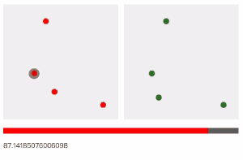

# stampCode
> 一个触摸印章技术的实现方案（点位携信）

## [Demo](https://browniu.github.io/stampCode/)



## 需求

先还原一个场景：许多开发者大会/漫展/游戏展，都会有集印章的线下推广活动。就是在入口处给你发张DM单，上面会有一些空格位置，需要你到指定的展摊集印。
到摊位前完成一些简单任务（加个微信或关注个公众号什么的）就会有小姐姐给你拿钢印盖个章或者签个名，集满或达到一定数量就可以兑换礼品。

在我看来这种传统的印章签到方式本身存在很多问题。

* 制作成本高。首先需要印刷纸质的DM传单来接受盖印，又要给每个摊位制作专用章，还要有一个工作人员值班负责这件事（无法离开摊位）
* 效率很低，盖印要很用力的压在一个平整的桌面上，盖印盖多了要沾印泥，这一系列动作耗时耗力，在火爆的情况下，很容易大排长龙，造成用户流失
* 用户体验不佳。作为吃瓜群众的我要随身携带这张纸。还要不停掏出来折回去，保存麻烦还很容易弄丢。而且刚盖完上面没干的墨水还会弄脏我新买的衣服

身为一个前端工程师，肩负着匡扶正义的历史使命。所以我就想能否通过前端的技术去优化这个流程（其实通过一个H5去解决这个问题是最廉价的方式/捂脸）。

这个需求点分析透彻就是一个线下签到问题。这并不是一个新问题，有很多的技术方案。现在使用最多的解决方案就是扫码。工作人员扫你的个人二维码，既可以杜绝伪签，用户的成本也不高。但是能不能更好玩一点，更有仪式感一点。想象一下我拿个印章在你的手机上
盖了一下就完成签到，这种体验我觉得既满足用户集邮般的收集感，又消除了上面说的传统印章各种缺陷。

这种技术类似于屏下指纹但是又不需要那么高的精度，所以就想到可以通过多点触控的方式同时获取到屏幕上的多个点位。拿到类似`[[x1,y1],[x2,y2],[x3,y3]]`这样的二维数组

也就是一个新采集到的二维数组和一个固定的二维数组进行比较。

观察盖印章的过程会发现这些点位的方向会不固定，而且因为屏幕DPI的原因，点与点直接的绝对距离也不是固定值。

所以我觉个从多边形相似这个思路会更加容易。距离不固定，但是有一个值是固定的，就是各点间距离的比率，先假设一种简单的情况，目前只采集三个触摸点p1,p2,p3

```JavaScript
d1=p1->p2 //表示d1是p1到p2的距离
d2=p1->p3
d3=p2->p3  
```

能拿到各点之间的距离，然后找到这三个距离中的最小值，求出其他距离和它的比率（假设d2最小）

```JavaScript
r1 = d1/d2
r2 = d3/d2
code = [r1,r2].sort()
```
无论屏幕分辨率是多少，或者采集点位的顺序（也就是盖印时印章的方向）怎样，都会得出一样的`code`。假设印章的点位是`n`，那么`code.length`为`n-1`

然后还要考虑实物印章的点位可能并不是一像素的针点，而是一个比较小的面，所以要设置容差

那现在的问题就变成了比较两个一维数组的相似性。我想实现的最终效果是我会得到一个`0-100`的分数，那么数组中的每一位值对这个一百分的影响程度就是`100/code.length`

```JavaScript
code1=[x1,y1]
code2 =[x2,y2]
```

x为对相似度分数的影响程度是50分，也就是说当x1=x2时，能拿到最高分50分,x1-x2 的绝值越大拿到的分数会越趋近于0

最后把每个位置的相似分数相加，这个分数就介于0-100,且相似性越高分数越高。在实际运算的过程中还发现分数会普遍偏高，所以又增加了一个衰减逻辑，离100分越远衰减越快。这样可以在不影响高分结果的情况下拉开分数梯度。

整个思路非常简单，凭直觉一步步算下来，也许有更高明更精确的算法去解决整个问题或者其中的一部分，非常希望能够有同学能告诉我，这只是我昨晚失眠一晚上想到的所有细节。没有经过反复推敲和验证，仅作为灵感记录，
另外我在查询相关信息的时候发现很少有相关的技术讨论，所以想抛砖阴雨。

网上搜搜其实可以看得到类似的成熟的解决方案，但是价格高的离谱，而且搞得相当神秘。它可能有更精妙的算法和硬件支持。但我觉得原理是应该跟我这套相差无几。而且这是开源的。

最后作出来的智能印章大概这个样子，可以做成一次成型的这样每次都都是这个图像，如果想提高被破解的难度可以做成活字印刷版那样可以调节点位的。

## 核心逻辑

```JavaScript
// 计算两点间距离
const distance = (x0, y0, x1, y1) => Math.hypot(x1 - x0, y1 - y0);

// 生成指定范围的二维点位
const randomPosInRange = (min, max) => Array.from({length: 2}, () => Math.floor(Math.random() * (max - min + 1)) + min);

// 生成指定位数和范围的二维点位组合
const RPIRInCount = (min, max, n) => Array.from({length: n}, () => randomPosInRange(min, max));

// 绘制点位组合
const drawPoints = (points) => console.log('draw');

// 计算各点的相互距离
const pointsDistance = (points) => {
    let array = [];
    for (let i = 0; i < points.length; i++) {
        for (let j = i + 1; j < points.length; j++) {
            const p1 = points[i];
            const p2 = points[j];
            array.push(distance(p1[0], p1[1], p2[0], p2[1]));
        }
    }
    return array
};
// 计算数组中的最小值
const minInArray = (array) => array.sort((a, b) => a - b)[0];

// 计算各点距离与最小距离的倍数
const distanceMultiple = (points) => {
    const distances = pointsDistance(points);
    const minDistance = minInArray(distances);
    const code = distances.map(distance => round(distance / minDistance, 0));
    code.shift();
    return code

};

// 四舍五入到指定位数
const round = (n, decimals = 0) => Number(`${Math.round(`${n}e${decimals}`)}e-${decimals}`);

// 近似匹配
const approximateMatch = (a, b, range) => Math.abs(a - b) >= range;
```

## 运行
```bash
cd src && serve
```
